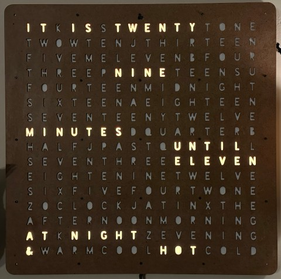
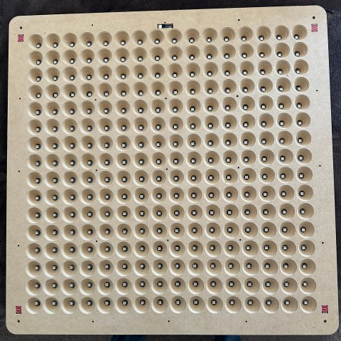
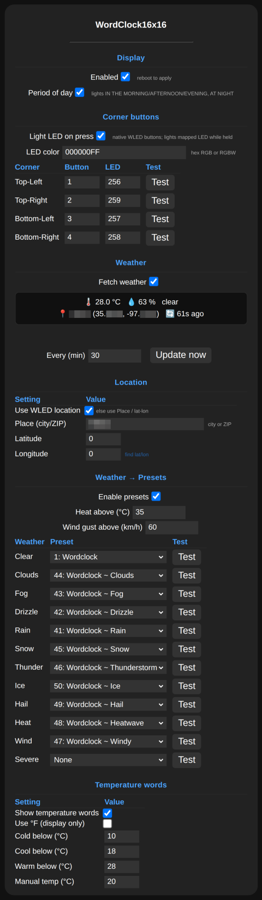

# Word Clock FX | WLED 16x16 w/ ESP32
**Author:** Austin St. Aubin <austinsaintaubin@gmail.com> | **License:** MIT

A community [WLED](https://github.com/wled/WLED) usermod. It adds an **Effect** named
**"Word Clock FX"** to WLED. Because it is a regular effect (not an overlay like the older
`usermod_v2_word_clock`), it can be transitioned/crossfaded, colored, palette-mapped, and
saved per-preset like any other effect.

It shows the time in English with **exact-minute** phrasing plus the period of day, e.g.
`IT IS TWENTY ONE MINUTES PAST SEVEN IN THE EVENING`.

The word **layout is selectable** in the usermod settings: the original **16×16 exact-minute**
face (default), an **11×10 "WordClock 2022"** face with 5-minute phrasing, or a **custom
layout** loaded from a `/wordclock.json` file — see [Layouts](#layouts).

> **Note:** this usermod (code, settings UI, and docs) was developed with **AI assistance**
> and validated by building against WLED. Review before use and verify on your own hardware.

> **Community usermod — use at your own risk.** This is a third-party usermod and is **not**
> reviewed, tested, endorsed, or supported by the WLED project. Usermods compile into your
> firmware with full access to your device. Read the source before flashing.

> **Personal note:** this is the **MK2** build of my word clock — the second hardware revision of
> the project (the original MK1 links live under [Resources](#resources)). The repo name keeps the
> `16x16` to mark this specific build.

---

## Resources
- [Video demo (YouTube)](https://youtu.be/wZmo6SdLq88)
- [Wordclock MK1 - Twitter/X](https://x.com/AustinStAubin/status/904725600484696069)
- [Wordclock MK1 - w/ Text Shift / Rotation (Adobe Illistrator)](https://docs.google.com/spreadsheets/d/1PluM_poY26YVuXqRocmyo1mvG5tT44V26rKZcX5UzbI/edit?gid=0#gid=0)
- [Wordclock MK1 - Build Sheet](https://docs.google.com/spreadsheets/d/1UgpLxv2-_UMIiSN81n5ciU93GWFkNPKmxRbwsBQ3MRw/edit?gid=35318254#gid=35318254)
- [Wordclock MK1 (16x16) - Inventables Easel](https://easel.com/projects/LeV5aEw0NV_JYsKv2mjWpw)

## Hardware
- Controller: Wemos Lolin32 w/ SSD1306 64x128 (its what I had on-hand... recommend newer esp32 controllers)
- LED Strips: 256x + 4x WS2814 RGBW (GRB)
- Buttons: TTP223 Touch Button Module (capacitive, single-channel; "self-locking" / latching variant)
- Sensors: 
  - HTU21D BMP180 BH1750FVI 3 IN 1 Temperature Humidity Pressure Light Sensor Triad Module

---

## Layout
A 16×16 RGBW LED matrix occupies the center of the display for the word clock functionality. Outside this matrix, each corner contains a dedicated push button and a corresponding addressable RGBW LED on a seperate strip from the 16x16 matrix. (4x discrete RGBW LEDs and 4x push buttons).





▶️ [Watch the video demo (YouTube)](https://youtu.be/wZmo6SdLq88)


### Layout (Words)

|   |   |   |   |   |   |   |   |   |   |   |   |   |   |   |   |
| - | - | - | - | - | - | - | - | - | - | - | - | - | - | - | - |
| I | T | K | I | S | S | T | W | E | N | T | Y | T | O | N | E |
| T | W | O | W | T | E | N | J | T | H | I | R | T | E | E | N |
| F | I | V | E | M | E | L | E | V | E | N | B | F | O | U | R |
| T | H | R | E | E | P | N | I | N | E | T | E | E | N | S | U |
| F | O | U | R | T | E | E | N | M | I | D | N | I | G | H | T |
| S | I | X | T | E | E | N | A | E | I | G | H | T | E | E | N |
| S | E | V | E | N | T | E | E | N | Y | T | W | E | L | V | E |
| M | I | N | U | T | E | S | D | Q | U | A | R | T | E | R | B |
| H | A | L | F | J | P | A | S | T | Q | U | N | T | I | L | L |
| S | E | V | E | N | T | H | R | E | E | E | L | E | V | E | N |
| E | I | G | H | T | E | N | I | N | E | T | W | E | L | V | E |
| S | I | X | F | I | V | E | F | O | U | R | T | W | O | N | E |
| Z | O | C | L | O | C | K | J | A | T | I | N | X | T | H | E |
| A | F | T | E | R | N | O | O | N | M | O | R | N | I | N | G |
| A | T | K | N | I | G | H | T | Z | E | V | E | N | I | N | G |
| & | W | A | R | M | C | O | O | L | H | O | T | C | O | L | D |

### Layout (LED IDs)
> NOTE: 16x16, serpentine.

|     |     |     |     |     |     |     |     |     |     |     |     |     |     |     |     |
| --- | --- | --- | --- | --- | --- | --- | --- | --- | --- | --- | --- | --- | --- | --- | --- |
| 0   | 1   | 2   | 3   | 4   | 5   | 6   | 7   | 8   | 9   | 10  | 11  | 12  | 13  | 14  | 15  |
| 16  | 17  | 18  | 19  | 20  | 21  | 22  | 23  | 24  | 25  | 26  | 27  | 28  | 29  | 30  | 31  |
| 32  | 33  | 34  | 35  | 36  | 37  | 38  | 39  | 40  | 41  | 42  | 43  | 44  | 45  | 46  | 47  |
| 48  | 49  | 50  | 51  | 52  | 53  | 54  | 55  | 56  | 57  | 58  | 59  | 60  | 61  | 62  | 63  |
| 64  | 65  | 66  | 67  | 68  | 69  | 70  | 71  | 72  | 73  | 74  | 75  | 76  | 77  | 78  | 79  |
| 80  | 81  | 82  | 83  | 84  | 85  | 86  | 87  | 88  | 89  | 90  | 91  | 92  | 93  | 94  | 95  |
| 96  | 97  | 98  | 99  | 100 | 101 | 102 | 103 | 104 | 105 | 106 | 107 | 108 | 109 | 110 | 111 |
| 112 | 113 | 114 | 115 | 116 | 117 | 118 | 119 | 120 | 121 | 122 | 123 | 124 | 125 | 126 | 127 |
| 128 | 129 | 130 | 131 | 132 | 133 | 134 | 135 | 136 | 137 | 138 | 139 | 140 | 141 | 142 | 143 |
| 144 | 145 | 146 | 147 | 148 | 149 | 150 | 151 | 152 | 153 | 154 | 155 | 156 | 157 | 158 | 159 |
| 160 | 161 | 162 | 163 | 164 | 165 | 166 | 167 | 168 | 169 | 170 | 171 | 172 | 173 | 174 | 175 |
| 176 | 177 | 178 | 179 | 180 | 181 | 182 | 183 | 184 | 185 | 186 | 187 | 188 | 189 | 190 | 191 |
| 192 | 193 | 194 | 195 | 196 | 197 | 198 | 199 | 200 | 201 | 202 | 203 | 204 | 205 | 206 | 207 |
| 208 | 209 | 210 | 211 | 212 | 213 | 214 | 215 | 216 | 217 | 218 | 219 | 220 | 221 | 222 | 223 |
| 224 | 225 | 226 | 227 | 228 | 229 | 230 | 231 | 232 | 233 | 234 | 235 | 236 | 237 | 238 | 239 |
| 240 | 241 | 242 | 243 | 244 | 245 | 246 | 247 | 248 | 249 | 250 | 251 | 252 | 253 | 254 | 255 |

---

## Pin Info

Only the pins used by this build are listed; all other ESP32 GPIOs are free.

| Pin    | Used by     | Pin Notes         | Button | LED     | Location      |
| ------ | ----------- | ----------------- | ------ | ------- | ------------- |
| GPIO0  | Button      | Touch, Flash Boot | 0      |         | On Controller |
| GPIO4  | I2C         | Touch (SDA)       |        |         | OLED (opt.)   |
| GPIO5  | I2C         | SCL               |        |         | OLED (opt.)   |
| GPIO12 | Button      | Touch, Bootstrap  | 3      | 256     | Bottom Left   |
| GPIO13 | Button      | Touch             | 2      | 259     | Top Right     |
| GPIO14 | Button      | Touch             | 1      | 257     | Top Left      |
| GPIO15 | Button      | Touch             | 4      | 258     | Bottom Right  |
| GPIO25 | LED Digital | 256x WS2814       |        |         | Matrix        |
| GPIO26 | LED Digital | 4x WS2814         |        | 256-259 | Corners       |

---

## Install / Build

This is an **out-of-tree** usermod, consumed via WLED's git-URL `custom_usermods` mechanism —
you don't copy it into the WLED source tree. (It makes no changes to `wled00/` and uses the
default `USERMOD_ID_UNSPECIFIED`.) See the WLED docs:
[Writing a usermod → Share it via git URL](https://kno.wled.ge/advanced/custom-features/#writing-a-usermod).

1. Get the [WLED](https://github.com/wled/WLED) source.
2. In a `platformio_override.ini` at the WLED repo root, reference this repo by URL in your build
   environment's `custom_usermods`:
   ```ini
   custom_usermods = https://github.com/AustinSaintAubin/wled-usermod-word-clock-fx-16x16.git#main
   ```
   PlatformIO fetches it automatically — no manual copy and no git submodule needed. The `wled-`
   library name is auto-recognized as a usermod. Pin a release with `#v1.3.0` instead of `#main`
   if you prefer a fixed version. For local development you can instead point at a checkout:
   `custom_usermods = symlink:///absolute/path/to/wled-usermod-word-clock-fx-16x16`.
3. Build & flash for your ESP32 (Wemos Lolin32).

A ready-to-copy [`examples/platformio_override.sample.ini`](examples/platformio_override.sample.ini) is included
(the git-URL `custom_usermods` line, size-trim flags, optional OLED, the
`WCFX_DEFAULT_TRANSITION_MS` example, NTP/timezone, and an OTA upload env) — copy it to the WLED
repo root as `platformio_override.ini` and adjust.

An example preset set [`examples/wled_presets.example.json`](examples/wled_presets.example.json) is also included
(a "Wordclock" preset plus the per-weather presets the table maps to) — import it via WLED's
**Presets → Backup/Restore** to get a working starting point.

## Usage

1. In WLED **LED Preferences**, configure a **2D matrix** matching your build (16×16 for
   the default layout), and set the serpentine / orientation to match the physical wiring
   (the LED-ID table above is serpentine). The effect works in logical X/Y, so all wiring
   specifics are handled here, not in code.
2. Make sure the device clock is set (NTP + time zone in **Time & Macros**).
3. Select the **Word Clock FX** effect on the matrix segment.
   - **Color 1** sets the lit-word color (or pick a **palette** to spread color across
     the matrix).
   - The **Background** slider (intensity) optionally lights all letters faintly behind
     the active phrase (0 = classic all-off look).
   - Minute-to-minute changes **crossfade** using the WLED **Transition** time (the
     "Transition: x.x s" control), so words fade in/out instead of snapping. Set the
     transition to 0 for instant changes.
4. Usermod settings: `enabled` (registers the effect; reboot to apply),
   `showPeriodOfDay` (toggle the MORNING/AFTERNOON/EVENING/NIGHT — or AM/PM — words),
   the `Layout` selector below, and the temperature options.

### Layouts

The **Layout** dropdown in the usermod settings selects the word face:

| Layout | Grammar | Notes |
| ------ | ------- | ----- |
| **16×16 exact-minute** (default) | exact minute | The original MK2 face documented above; period-of-day + temperature words. |
| **11×10 WordClock 2022** | 5-minute steps | The popular [WordClock 2022](https://www.printables.com/model/311949) face; AM/PM tiles (shown when `showPeriodOfDay` is on). |
| **Custom (`/wordclock.json`)** | either | Your own face, loaded from a file on the WLED filesystem. |

Positioning: the layout draws from the **segment's top-left**. If the word face doesn't fill
the whole matrix (e.g. an 11×10 face padded into a 12×12 matrix), frame it with the segment's
**2D start/stop bounds** — no usermod setting needed. The active layout (and, for custom, the
parse result) is shown on the WLED **Info** page.

**5-minute grammar** floors to the last 5-minute step (10:04 still reads `TEN O'CLOCK`),
`PAST`/`TO` around the half hour, `A QUARTER` at :15/:45, `TWENTY FIVE` as TWENTY+FIVE.
Enable **Minute dots** (Corner buttons section) to show the floored-off 1–4 minutes on the
corner LEDs.

**Custom layout** — upload a `wordclock.json` to the WLED filesystem via the `/edit` page
(like `ledmap.json`), select **Custom** in the dropdown, and save. A ready-made 11×10 example
is included at [`examples/wordclock_11x10.json`](examples/wordclock_11x10.json). Format:

```json
{ "w": 11, "h": 10, "grammar": "five",
  "words": [ ["it",0,0,2], ["is",3,0,2], ["h1",0,5,3], ["oclock",5,9,6] ] }
```

- `w`/`h` — grid size (1–32 each); `grammar` — `"five"` or `"exact"`.
- Each word is `[role, x, y, len]`: 0-indexed top-left cell + run length (horizontal).
- Roles: `it is a quarter half past to until oclock minutes am pm in the at morning
  afternoon evening night amp cold cool warm hot`, minute numbers `m1`–`m20` (+ `m25` for a
  dedicated TWENTYFIVE tile), hours `h1`–`h12`. `until` is an alias of `to`. Repeating a role
  makes a multi-segment word (all segments light). Roles the grammar wants but the layout
  lacks are simply skipped.
- After editing the file, either save the usermod settings again, reboot, or send
  `{"WordClockFx":{"reloadLayout":true}}` to the JSON API. Errors fall back to the 16×16
  layout and are reported on the **Info** page.

### Grammar (exact-minute layouts)
- On the hour: `IT IS <hour> O'CLOCK`
- 1–30 past: `IT IS <minutes> MINUTES PAST <hour>` (`A QUARTER PAST` at :15, `HALF PAST` at :30)
- 31–59: `IT IS <minutes> MINUTES UNTIL <next hour>` (`A QUARTER UNTIL` at :45)
- Period: `IN THE MORNING` (00–11), `IN THE AFTERNOON` (12–16), `IN THE EVENING` (17–20),
  `AT NIGHT` (21–23).

### Grammar (5-minute layouts)
- On the step: `IT IS <hour> O'CLOCK`, `FIVE/TEN/A QUARTER/TWENTY/TWENTY FIVE PAST <hour>`,
  `HALF PAST <hour>`, then `... TO <next hour>`; minutes are **floored** to the step.
- `AM`/`PM` lights when `showPeriodOfDay` is on (layouts with those tiles).

## Settings



---

### Temperature words (bottom row)
When `showTemperature` is on, one of `COLD / COOL / WARM / HOT` is lit on the bottom row
(folded into the same crossfade as the time). Bands are picked by numeric thresholds:

| Word | Condition |
| ---- | --------- |
| COLD | `temp < coldBelow` |
| COOL | `coldBelow ≤ temp < coolBelow` |
| WARM | `coolBelow ≤ temp < warmBelow` |
| HOT  | `temp ≥ warmBelow` |

All temperature numbers — thresholds, `manualTemp`, and the JSON-API value — are in **°C**
(defaults 10 / 18 / 27). The `fahrenheit` option only changes how the temperature is shown
on the Info page; it does **not** change the threshold units.

When a temperature word is shown, the `&` tile (bottom-left, LED 240) lights too.

**Temperature source:** either the built-in Open-Meteo client (below), or push a live
value (°C) via the JSON API (state object):
```json
{"WordClockFx":{"temp":22.5}}
```
The live value (whichever source) is used for 30 min, then falls back to `manualTemp`.
The current temperature + weather state is shown on the WLED **Info** page.

### Weather (Open-Meteo, built in)
Turn on `fetchWeather` to pull the current outdoor temperature and condition from
[Open-Meteo](https://open-meteo.com) (free, no API key) every `fetchMinutes` (default 15).
Plain HTTP, so no TLS library / `lib_deps`.

> **HTTPS is not available on this firmware.** The WLED ESP32 framework
> (Tasmota's platform-espressif32) is built with mbedTLS **TLS disabled**
> (`CONFIG_MBEDTLS_TLS_DISABLED=y`) and ships no `WiFiClientSecure`, so a usermod cannot
> make HTTPS requests on-device. That's why Open-Meteo (which serves the API over plain
> **HTTP**) is used. HTTPS-only sources such as **NWS / api.weather.gov** can't be queried
> directly here — to use observed conditions, push them in via the JSON API from an external
> system (e.g. Home Assistant's NWS integration → `{"WordClockFx":{"temp":..}}`), or run
> a local HTTP→HTTPS proxy. (On-device HTTPS would require rebuilding the framework with TLS
> enabled.)

> **Open-Meteo accuracy:** its `weather_code` is a *forecast model* value and can disagree
> with the observed sky (e.g. report a thunderstorm on a clear day). For exact current
> conditions, use the JSON-API push noted above.

- **Location** precedence: WLED **Time settings** lat/lon (when `useWledLocation` is on *and*
  actually set) → **`place`** (city or ZIP, geocoded via Open-Meteo) → manual
  `latitude`/`longitude` (a "find lat/lon" link is provided). Because of the "actually set"
  check, a `place` still works even if `useWledLocation` is ticked but WLED's coords are 0,0.
  Open-Meteo only matches the bare city, so a `", State"` qualifier is **dropped** before
  geocoding (e.g. `Edmond, Oklahoma` → `Edmond`); use a **ZIP** if the city name is ambiguous.
- **Humidity & condition** are shown on the WLED **Info** page alongside temperature.
- **Update now:** a button in the settings (and `{"WordClockFx":{"update":true}}` via the
  JSON API) fetches the weather immediately. The Usermod settings page shows a **live status
  line** (temp / humidity / condition / location / last-updated, read from `/json/info`) that
  refreshes after you press the button, so you can see whether the fetch succeeded
  (`Updated: Xs ago`) or not (`never`, or a `not found` / `unset` location). The same info
  also appears on the main UI **Info** panel.
- **Weather → preset:** turn on `weatherPresets`, then map each weather state to a preset in
  the **table** (Weather / Preset / Test columns). Each Preset is a **dropdown** of your saved
  presets (from `/presets.json`; 0 = none). When the detected state changes, that preset is
  applied. WMO codes are grouped as:

  | State | Source | Setting |
  | ----- | ------ | ------- |
  | clear   | WMO 0, 1          | `presetClear` |
  | clouds  | WMO 2, 3          | `presetClouds` |
  | fog     | WMO 45, 48        | `presetFog` |
  | drizzle | WMO 51–55         | `presetDrizzle` |
  | rain    | WMO 61–65, 80–82  | `presetRain` |
  | snow    | WMO 71–77, 85, 86 | `presetSnow` |
  | ice     | WMO 56,57,66,67 (freezing rain/drizzle) | `presetIce` |
  | thunder | WMO 95            | `presetThunder` |
  | hail    | WMO 96, 99 (thunderstorm w/ hail) | `presetHail` |
  | heat    | temp ≥ `heatAbove` on clear/cloudy skies | `presetHeat` |
  | wind    | gust ≥ `windAbove` km/h on clear/cloudy skies | `presetWind` |
  | severe  | tornado / hurricane / tropical — **external push only** | `presetSevere` |

  `heat` and `wind` are *derived* states (Oklahoma heat waves / high wind) and only
  override otherwise calm (clear/cloudy) conditions, so storms still win. `heatAbove` is in
  **°C** (default 35); `windAbove` is wind-gust km/h (default 60).
  `severe` has no Open-Meteo source (no WMO code for tornado), so it is only reached via the
  Test picker or a JSON-API push (`{"WordClockFx":{"wxtest":12}}`) — e.g. from Home
  Assistant when a severe alert is active.

  The preset is applied on a **change** of state, and once on the **first WiFi connect after
  boot** (a few seconds after the network comes up, similar to NTP) so the current weather's
  preset is set automatically. Later reconnects refresh data but won't override a manual
  selection. A periodic re-check runs every `fetchMinutes`. The Info page also shows the
  resolved **location** and **last-updated** time; a failed fetch retries after ~1 min, and if
  data goes stale (older than 30 min) the condition shows `stale` and temperature falls back to
  `manualTemp`.

  To verify a mapping, press the **Test** button on that row — it force-applies the state's
  preset (bypassing the change-only check). The same works via the JSON API:
  `{"WordClockFx":{"wxtest":5}}` (5 = rain; 1–12 in the table order above).

### Corner buttons → corner LEDs
Lights a corner LED **while its button is held**, on top of normal **native WLED button +
preset control** (WLED still runs whatever preset/action you assign to the button — this only
adds the LED feedback, which WLED can't do natively).

Setup:
1. Configure the corner LEDs as a **second LED output** in WLED LED Preferences (e.g. 4 px on
   GPIO26 starting at index 256 → pixels 256–259), and the buttons natively in the **Button**
   setup (TTP223 = "Pushbutton (act. high)").
2. In the usermod settings, **Corner buttons** section:
   - `Light LED on press` — enable/disable the whole feature.
   - `LED color` — `RRGGBB` (or `RRGGBBWW` for the W channel), e.g. `FFFFFF`.
   - A **table** with one row per corner (**Top-Left, Top-Right, Bottom-Left, Bottom-Right**):
     set each corner's **button index** (WLED button number, −1 = off) and **LED index**
     (pixel number, −1 = off). Defaults match the wiring in *Pin Info*: TL=btn1→LED257,
     TR=btn2→LED259, BL=btn3→LED256, BR=btn4→LED258.
   - Each row has a **Test** button that briefly (~3 s) lights the LED index currently in that
     field, so you can confirm which physical LED maps to which corner before saving. (Same as
     the JSON API: `{"WordClockFx":{"ledtest":256}}`.)

The LED is lit (via `handleOverlayDraw`, scaled by master brightness) only while
`isButtonPressed()` is true for that button, so momentary and self-locking touch buttons both
work; when released it returns to its normal output.

**Minute dots** (same section): with a 5-minute layout the words can't show the exact minute —
enable `Minute dots` and the corner LEDs count the remainder (`minute % 5`, so 10:07 shows
`FIVE PAST TEN` + 2 dots). Dots fill in the corner-table order (TL → TR → BL → BR by default;
reorder the LED indices to change the fill direction), use the same `LED color`, and only show
while the Word Clock FX effect is active. A held corner button still overrides its dot.

---

## License
MIT © Austin St. Aubin. See `SPDX-License-Identifier: MIT` in the source.
